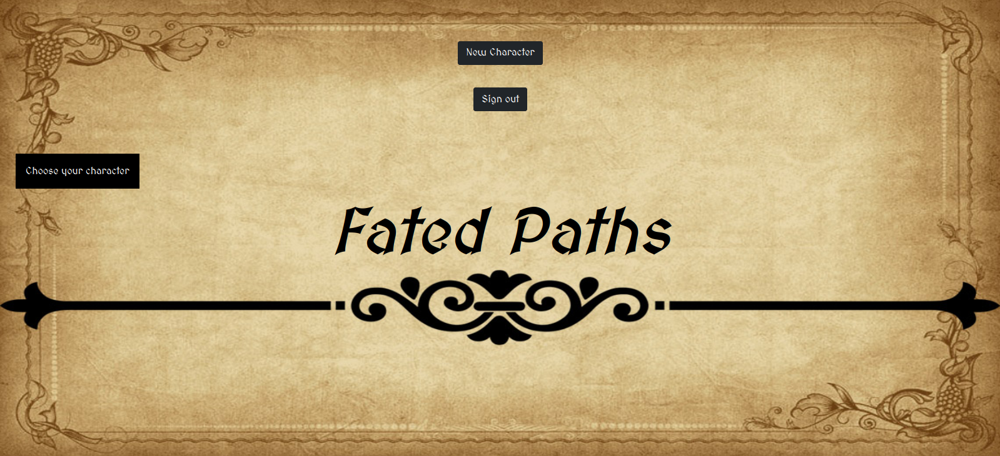
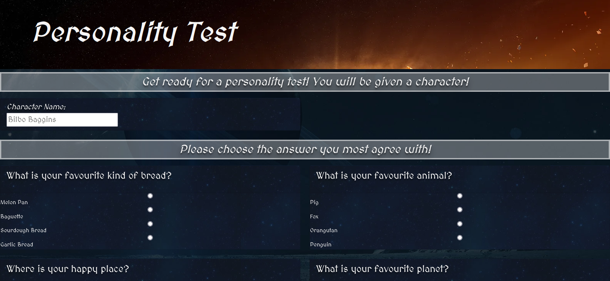
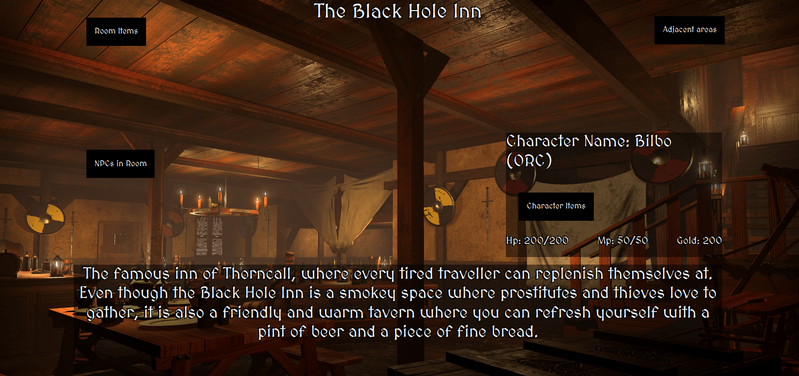
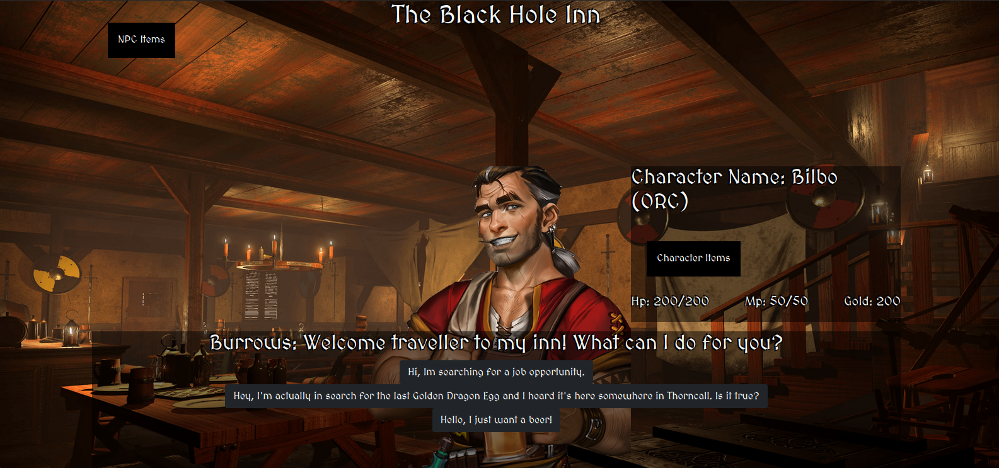
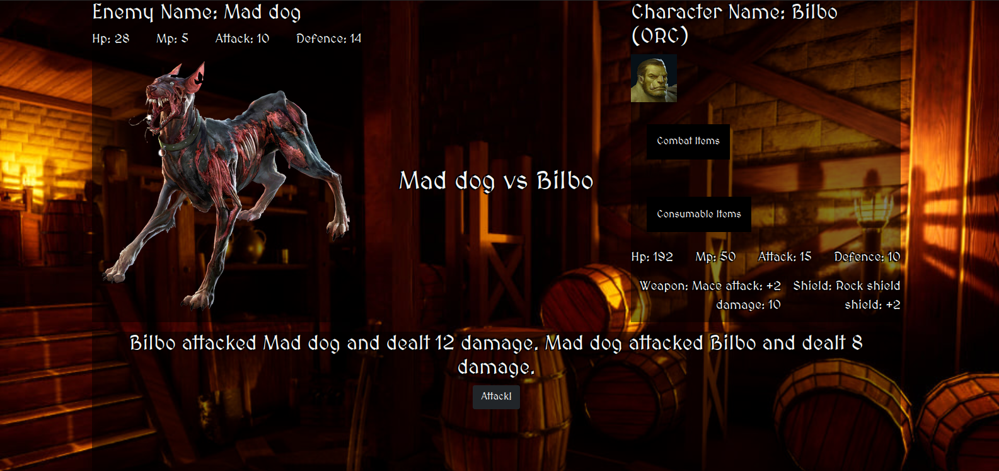

# Fated paths
### Description
A text based adventure role playing game, where you can play with 4 different characters and explore the enchanted world of Prougmathicque. You can interact with a wast array of npc-s, talk with them, trade with them and even fight with them for their precious loots. You can follow the story of the last Golden Dragon Egg or just explore the world freely.

This is a passion project of 4 people, we made this as our "big project" during a bootcamp. Currently the development is on hold, but we're planning to continue this project when we gain more experience and have more free time.

### Images from the game

#### Main menu

Here you can create a new character and start a new game, or continue your play through with an existing one.

 

#### Personality test

Based on your answers, the game gives you one of the 4 playable character. If you're not happy with your results, you can retake the test.

 

#### Rooms

 

#### Npc interaction

 

#### Combat

 

### Database

