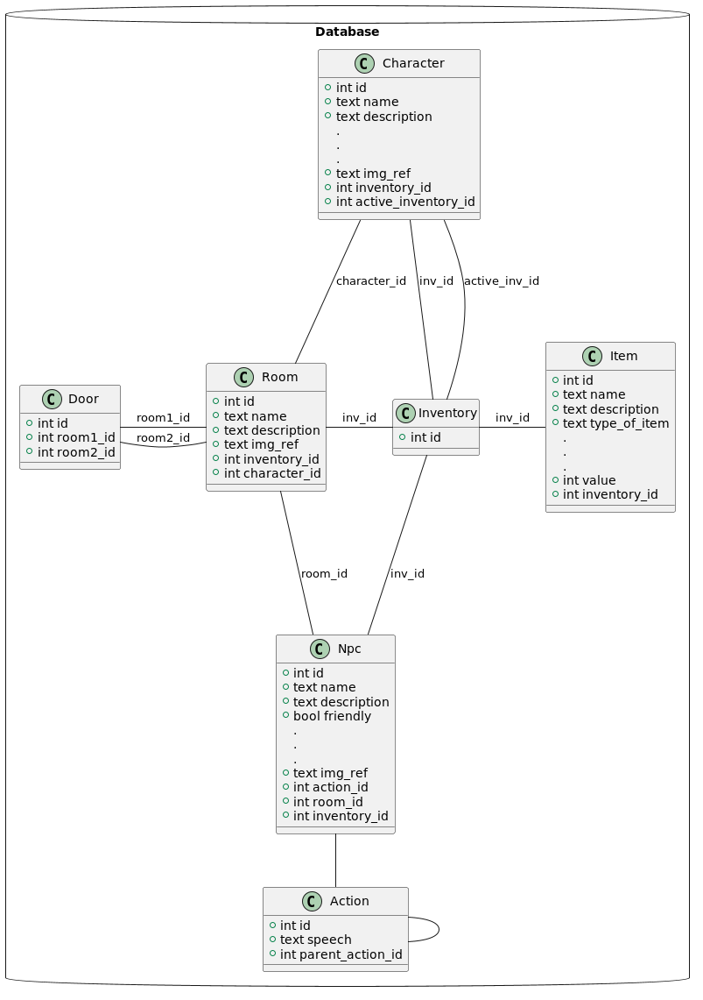

# Fated paths
### Description
A text based adventure role playing game, where you can play with 4 different characters and explore the enchanted world of Prougmathicque. You can interact with a vast array of npc-s, talk with them, trade with them and even fight them for their precious loots. You can follow the story of the last Golden Dragon Egg or just explore the world freely.

This is a passion project of 4 people, we made this as our "big project" during a bootcamp. Currently the development is on hold, but we're planning to continue this project when we gain more experience and have more free time.

### Images from the game

#### Main menu

Here you can create a new character and start a new game, or continue playing through with an existing one.

 

#### Personality test

Based on your answers, the game gives you one of the 4 playable characters. If you're not happy with your results, you can retake the test.

 

#### Rooms

Rooms are how you can explore the fantasy world. Here you can go to adjacent rooms, pick up items found in the room or interact with npc-s located in the room. Every room has a different background, description, item(s) and npc(s).

 

#### Npc interaction

You can interact with every npc in the game. Some have only 1 line of dialogue, others have branching dialogues with different outcomes.

 

#### Combat

If you encounter a non-friendly enemy, you can fight them. The combat is turn based, during your turn, you can switch weapon, shield and use consumables such as a health potion to heal yourself or magic scrolls to deal some damage. 

 

### Database

